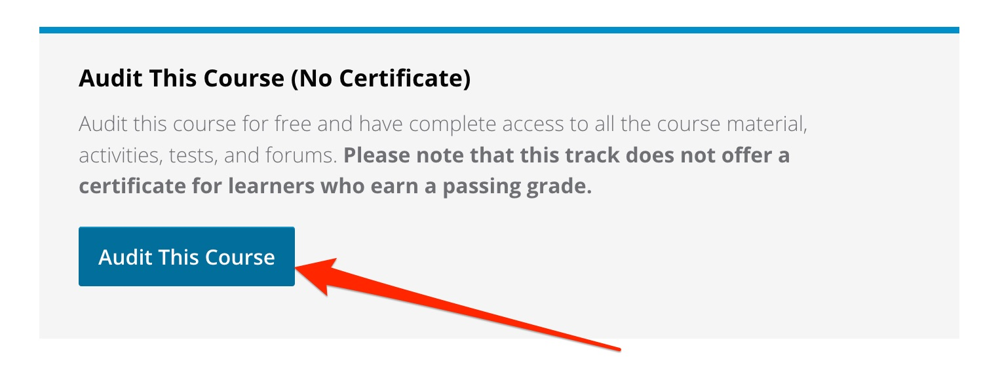
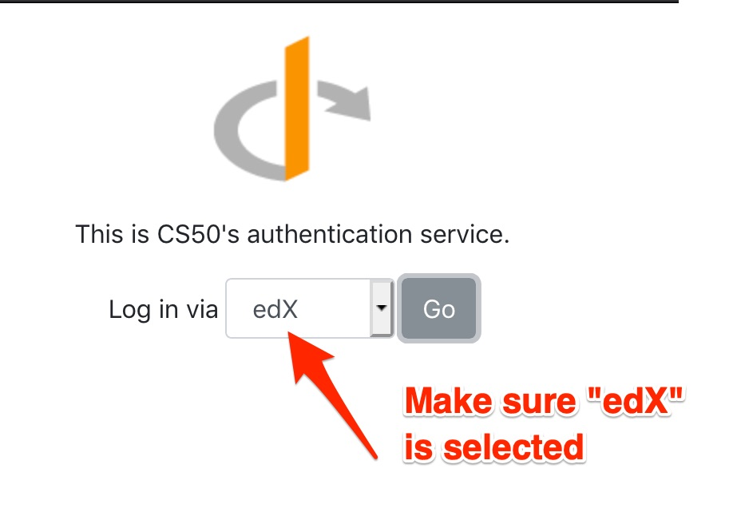
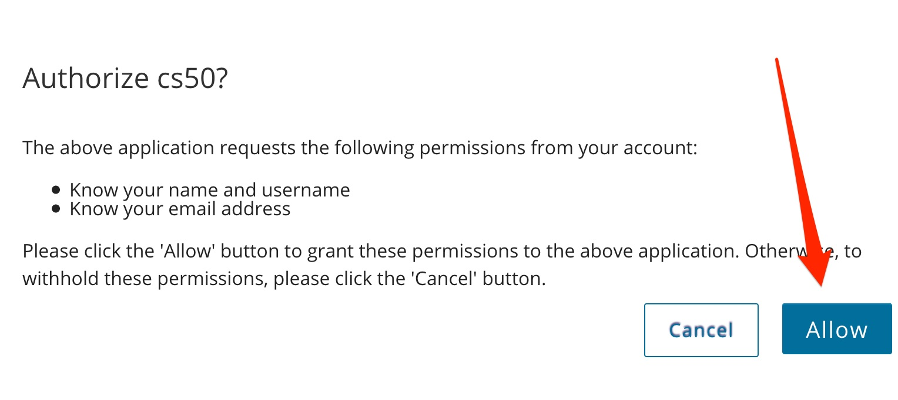
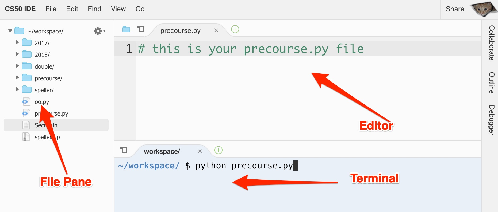
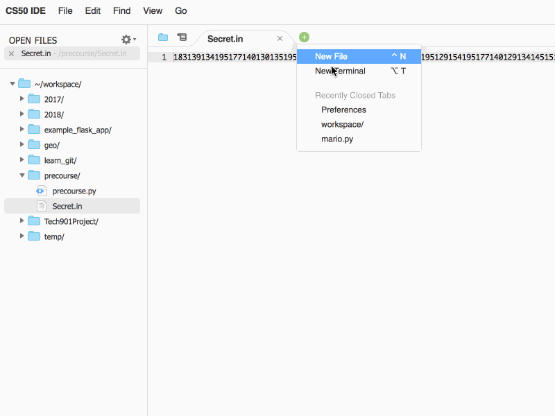
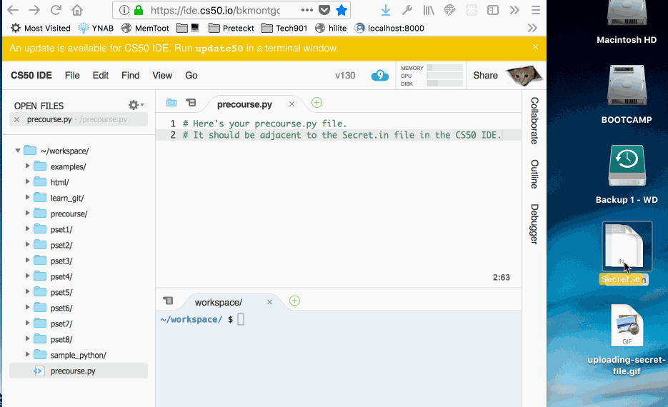

# Code 1.0 Precourse Challenge

This tutorial is intended to explain how to complete the Code 1.0 cyber security
challenge. It is not, however, a fully-complete tutorial on the Python language.
For simplicity, this tutorial will guide you through one possible path to the
solution. We have pulled together all the information you need in this document.

More complex concepts which may have taken more time to explain and comprehend
have been ignored or avoided. You will be expected to learn languages at a
deeper level during the Code 1.0 class, but for now we’ll keep it simple. There
is no reason for you not to succeed with this challenge, even if you are a
complete beginner, if you follow this guide.

**You can do this!**

## Contents

1. Chapter 1. [Sign Up with CS50 edX and set up your IDE environment](#chapter-1-sign-up-for-cs50)
2. Chapter 2. [Python Language Syntax (code formatting rules)](#chapter-2-python-language-syntax)
3. Chapter 3. [Python data and variables (numbers, letters, and such)](#chapter-3-python-data-and-variables)
4. Chapter 4. [Python operators](#chapter-4-python-operators)
5. Chapter 5. [Flow Control with the If statement (If this is true then do that, otherwise do something else)](#chapter-5-if-statements)
6. Chapter 6. [Python Loops (how to repeat something multiple times)](#chapter-6-loops)
7. Chapter 7. [Python File I/O (Input(reading from) / Output (writing to) a file)](#chapter-7-file-io)
8. Chapter 8. [Python conversion functions (How to change letters to numbers and such)](#chapter-8-conversion-functions)
9. Chapter 9. [ASCII table (numbers that represent letters)](#chapter-9-ascii-table)
10. Chapter 10. [Hashing and Encryption (How to decode and encrypt data)](#chapter-10-hashing-and-encryption)
11. Chapter 11. [The Secret.in file format (you will read from this)](#chapter-11-the-secretin-file)
12. Chapter 12. [The Results.out file format  (you will write to this)](#chapter-12-the-resultsout-file)
13. Chapter 13. [A Step-by-step guide](#chapter-13-a-step-by-step-guide)
14. Chapter 14. [Sending your results to us (and gloating about your success)](#chapter-14-sending-your-results-to-us)

## Chapter 1: Sign up for CS50

Much of the Code 1.0 course follows Harvard's CS50 curriculum. Additionally,
we'll use the online CS50 IDE environment to write and run our code.

### Part 1: Enroll in the CS50 course on edX.org

To get started, [Enroll in the the CS50x course at edX.org](https://www.edx.org/course/introduction-computer-science-harvardx-cs50x).  Look for the big blue "Enroll" button:

You will then need to create an account for edX.org. Remember this, as you'll
need it to log into the course.

Next, select **Audit This Course (No Certificate)**. That makes the content
freely available for you.

**Important** They'll send you an email to *activate* your account. You **MUST**
click on the link they sent you in order to continue using edX.

### Part 2: Set up your CS50 IDE (programming environment)

**NOTE: The CS50 IDE has recently changed, and the following instructions may
be a little out of date. We're working to get them updated soon. In the meantime,
you should be able to:**

1. Create an accout at [GitHub](https://github.com).
2. Then, log into [ide.cs50.io](https://ide.cs50.io) with your github account.

----

<!--
Next, we'll set up the programming environment that you'll use throughout the
course. Visit [ide.CS50.io](https://ide.cs50.io), and choose to login with your edX
credentials. This is important! You will use your edX username/password to
log into the CS50 IDE.

You will then be redirected to edX.org, and asked to Authorize cs50. Select the
"Allow" button:

-->

**Congrats!** You now have access to the CS50 IDE, which powered by a service
called AWS Cloud9.

You are now ready to work!

### A brief tour of the CS50 IDE

The programming environment that we will throughout this course is called the
CS50 IDE. It's a web-based programming environment, and should work well on any
modern computer: Macs, PCs running Windows or Linux, and even Chromebooks.

There are three main sections of the CS50 IDE:

1. The **File Pane** lists the files and directories in your workspace.
2. The **Editor** is a text editor; this is where we will write much of our code.
3. The **Terminal** gives you access to a Linux command line.

If you accidentally close the Editor or Terminal, you can always reopen them.
If your CS50 IDE looks different from the screenshot above, never fear! You
still have access to all the tools.

Here's how you'd open a new Terminal:

## Chapter 2. Python Language Syntax

Python is an extremely powerful language with many attributes and capabilities
that many appreciate when contrasted to other computer languages. In addition,
Python also contains an interactive interpreter which allows immediate commands
to be entered with actions performed and results displayed in real time.
It is for that reason that we chose it as a simple and effective tool to introduce
the concept of computer programing. Our examples will utilize the CS50 IDE and
the Python interactive command interpreter window it provides.

_Syntax_ is defined as “the arrangement of words and phrases to create well-formed
sentences in a language.”  In the case of computer science, the syntax of a
computer language is the set of rules that defines the combinations of symbols
that are considered to be a correctly structured document or fragment in that
language.

Python statements have a particular order and format to them that the Python
interpreter can process. All computer languages have their own specific syntax.
If you format a statement incorrectly Python will respond with an error.
You will have to correct the syntax in order to continue.

### Python Comments

When working with any programming language, you include comments in the code to
notate your work. This helps explain portions of your code, and lets other
developers – you included – know what you were thinking when you wrote the code.
This is a necessary practice, and good developers using comments wisely.

### How to Write Comments in Python

In Python, there are two ways to annotate your code. The first is to include
comments that detail or indicate what a section of code – or snippet – does.
The second makes use of multi-line comments or paragraphs that serve as
documentation for others reading your code.

Think of the first type as a comment for yourself, and the second as a comment
for others. There is no right or wrong way to add a comment, however. You can
do whatever feels comfortable.

Single-line comments are created simply by beginning a line with the hash
character (a `#`), and they are automatically terminated by the end of line.
This type of comment is called an _inline comment_. For example:

    # This would be a comment in Python

A Comment that spans multiple lines – used to explain things in more detail –
are created by wrapping the comments in triple-quotes (either `'''` or `"""`).
These are known as _docstrings_:

    '''This would be a multiline comment
    in Python that spans several lines and
    describes your code or anything you want it to.
    '''

Remember to comment as often as possible. It's important! Python has no
mandatory statement termination characters and blocks are specified by
indentation. Indent to begin a block, dedent to end one. Statements that
expect an indentation level end in a colon (:).  We’ll see some specific
examples later.

## Chapter 3. Python data and variables

Computer languages including Python work with and manipulate data in various
forms such as numbers and text. Variables are used to name and temporarily store
data while the computer is processing or performing actions on it. You can think
of variables as a box or container for pieces data. Every variable has a name
and a type.

The variable name is a descriptive label used to work with that particular storage
container (a location in the computer's memory) of data. Every variable has a
“type” which describes the type or nature of the data in the container.  A
variable that contains just number values is a different “type” than one that
contains text number characters or letters.

Python is a strongly typed (i.e. types are enforced), dynamically, implicitly
typed (i.e. you don't have to declare variables), case sensitive (i.e. var
and VAR are two different variables).  This means that when you use a variable,
Python automatically looks at the data you are storing and if it is a number
value, assigns it the correct type.

Values are assigned to variable names with the assignment operator, the equals
sign (`=`).  So you can write code like:

    a = 3

Python will determine that 3 is an integer and store it in a variable named `a`
as an integer type. You can use `a` to add, `a = a + 2`, or use the python
shorthand `a +=2`, or you can perform other mathematical operations because it
is an integer type. In both of the previous examples, the variable `a` would
contain the value 5.

You can assign text to a variable by writing something like:

    message = "Hello"

Python again automatically recognizes that "Hello" is text data and assigns the
variable names `message` with the type `str` or string. You can add or
concatenate more text to message by writing:

    message = message + " world"

Now, the variable `message` would contain the data “Hello world” (notice the
space in front of `" world"`). But if you attempted to add an integer value
(e.g. `message = message + 5`), python would raise an Exception (or an error).

Variable names can be almost any continuous string of characters long or short.
It is always good practice to make variable names meaningful to describe the
data or value they contain. For instance if you were writing a program for an
automotive use and needed to store the pressure of air in a tire, you could name
the variable `a`, `t`, or `tire_pressure`. All are valid variable names, but
only one is self-descriptive. Can you guess which one!? Later in a very complex
program it would be more meaningful if the variable name let you know at a
glance what information it represented.

Python defines many different data types. We will only concern ourselves with a
few simple types you will need to perform this challenge, Numbers and Strings.

### Python Numeric types

Numeric data types store numbers. Number objects are created when you assign a
value to them. For example:

    var1 = 1
    var2 = 10

Python supports three [numeric types](https://docs.python.org/3/library/stdtypes.html#numeric-types-int-float-complex):

- `int` (integers)
- `float` (floating point or decimal values)
- `complex` (complex numbers have a *real* and *imaginary* component; We
  won't use them in this tutorial)

Here are some examples of numbers:

| int            | float   |
|----------------|---------|
| 10             | 0.0     |
| 100            | 15.20   |
| -786           | -21.9   |
| -4721885298529 | 32.3e18 |

### Strings

Strings in Python are identified as a contiguous set of characters represented
in quotation marks. Python allows for either pairs of single or double quotes,
and you can have quotation marks of one kind inside a string that uses the other
kind (i.e. `"He said 'hello'."` is valid).

The plus (`+`) sign is the string concatenation operator and allows you to add
strings together to create longer strings. The asterisk (`*`) is the repetition
operator and will create multiple copies of the string. Equality testing is done
using two equals signs (`==`).

Subsets or parts of strings can be taken using the **indexing** and **slice**
operator (`[]` and `[:]`). An index is a kind of pointer to a particular
location in the string, starting at 0. In Python the first character location
or index is always 0 and not 1. You might need to use the subset slice operator
soon (hint hint)!

Here are some examples.

    message = 'Hello World!'
    print (message)          # Prints the complete string
    print (message[0])       # Prints first character of the string
    print (message[2:5])     # Prints characters starting from 3rd to 5th
    print (message[2:])      # Prints a subset of the string starting from the 3rd character
    print (message * 2)      # Prints the string two times
    print (message + "TEST") # Prints concatenated strings

The above code would produce the following results:

    Hello World!
    H
    llo
    llo World!
    Hello World!Hello World!
    Hello World!TEST

You can try this for yourself in the CS50 IDE! To launch a python interpreter,
find the terminal window, and at the `$` prompt, type `python`. At this point,
you should see a `>>>` prompt. This is the python prompt; You are now working
with a python interactive shell. Type:

        str  = "Hello World!"

Then to print the string, you can write the following code (NOTE: you don't have
to type the `>>>`, but you should see them on your screen).

     >>>  print(str)

Try each of the commands in the example above.

## Chapter 4. Python Operators

Operators are the constructs which can manipulate the value of operands.
Consider the expression: 4 + 5 = 9. Here, 4 and 5 are called operands and + is
called an operator.

### Types of Operators

Python supports the following types of operators.

- Arithmetic Operators
- Comparison (Relational) Operators
- Assignment Operators
- Logical Operators
- Bitwise Operators

#### Python Arithmetic Operators

Assume the variable `a` contains the value 10 and the variable `b` contains
the value 20, then:

| Operator           | Description                                          | Example | Result |
|--------------------|------------------------------------------------------|---------|-----|
| `+` Addition       | Adds values on either side of the operator.          | `a + b` | 30  |
| `-` Subtraction    | Subtracts right hand operand from left hand operand. | `a – b` | -10 |
| `*` Multiplication | Multiplies values on either side of the operator     | `a * b` | 200 |
| `/` Division       | Divides left hand operand by right hand operand      | `b / a` | 2   |

#### Comparison Operators

These operators compare the values on either sides of them and decide the relation
among them. They are also called Relational operators.

Assume variable `a` contains the value 10 and variable `b` contains the value 20, then:

- `==` **Equality**: If the values of two operands are equal, then the expression
  is true. `a == b` is not true.
- `!=` **Not Equal**: If values of two operands are not equal, then the
  expression is true. `a != b` is true.
- `>` **Greater than**: If the value on the left is greater than the value on
  the right, then the expression is true. `a > b` is not true.
- `<` **Less than**: If the value on the left is less than the value on the right,
  then the expression is true: `a < b` is true.
- `>=` **Greater than or equal to**: If the value on the left is greater than
  or equal to the value on the right, then the expression is true. `a >= b` is not true.
- `<=` **Less than or equal to**: If the value on the left is less than or equal
  to the value on the right, then condition becomes true. `a <= b` is true.

#### Assignment Operators

You've already seen how the `=` assignment operator can be used, but python also
has some *compound assignment* operators. These are simply shorthand for common
arithmetic operators, as you'll see below.

Assume variable `a` contains the value 10 and variable `b` contains the value 20, then:

- `=` **Assignment**: Stores the value in the right in the variable on the left,
  e.g. `a = 10` or `b = 20`.
- `+=` **Compound add**: Adds the value on the right to whatever is current stored
  in the variable and replaces that result in the variable. e.g. `a += 5` would
  result in `a` containing the value 15. This is the same as: `a = a + 5`.
- `-=` **Compound subtract**: Similar to compound addition, `a -= 3` would result
  in `a` containing the value 7. This is the same as `a = a - 3`.
- `*=` **Compound multiplication**: `a *= 5` would result in
  `a` containing the value 50. This is the same as: `a = a * 5`
- `/=` **Compound division**: `a /= 2` would result in `a` containing the value
  5, which is the same as `a = a / 2`.

#### Bitwise Operators

The bitwise operator works on bits (binary digits, i.e. 1 and 0) and performs
bit by bit operation. Each character or byte of data is made up of a group
(usually 8) bits. The bits are ordered so that each position represents binary
data where the only valid values are 0 and 1s. Each of these are added together
according to their position order to make up 8 bit values from 0 to 255. The
operations below compare the bit positions individually between a and b and
utilize the operation indicated by the operator to create a resulting bit
sequence. In the examples below, the "logical and" `&` operator only evaluates
as true. Assume `a = 60` and `b = 13`. These values are expressed in binary
format below:

    a = 0011 1100
    b = 0000 1101

The result of various bitwise operators are expressed below.

**Bitwise And** (the `&` operator) returns a 1 if both values are equal to 1.
Otherwise it returns a 0.

    a   = 0011 1100
    b   = 0000 1101
    -----------------
    a&b = 0000 1100

**Bitwise OR** (the `|` operator) returns a 1 of _either_ value contains a 1,
otherwise it returns a 0.

    a   = 0011 1100
    b   = 0000 1101
    -----------------
    a|b = 0011 1101

**XOR or Exclusive OR** (the `^` operator) will copy the bit if it is set in
one operand but not both. **HINT** this is important!

    a   = 0011 1100
    b   = 0000 1101
    -----------------
    a^b = 0011 0001

**Binary Ones Complement** (the unary `~` operator) has the effect of "flipping"
bits, or swapping from 0 to 1 or from 1 to 0.

    a  = 0011 1100
    ~a = 1100 0011

## Chapter 5. If statements

Python allows us to ask Yes or No questions, based on the value contained
in a variable, the result of a calculation, or some other expression. This
generall takes the form of an `if` statement.

Here's an example that tells us if the value stored in an integer variable is
equal to 42.

    some_value = 3
    if some_value == 42:
        print("Yes! This value is equal to 42")

In this example, the answer to our question is, "No". Sometimes we may also
want to perform an action if that's the case. We can use an `else` clause for
that scenario:

    some_value = 3
    if some_value == 42:
        print("Yes! This value is equal to 42")
    else:
        print("No! It's not 42 :(")

We may also want to ask a subsequent question; for example: Is the value
equal to 42, and if not, is it equal to zero? We can use the `elif` clause
for this.

    some_value = 3
    if some_value == 42:
        print("Yes! This value is equal to 42")
    elif some_value == 0:
        print("No, but the value is ZERO")
    else:
        print("No! It's not 42 :(")

You can continue to ask questions using `if`, `elif`, and `else` throughout
your program, and you can even nest these questions inside other constructs
(like loops).

## Chapter 6. Loops

Computer programs are very good at doing things over and over very quickly. One
way to do this is to perform a loop. Python has two main looping constructs.

### while loops

The `while` loop is often used to perform a task until some criteria, or condition
evaluates to false. For example, we can write code that prints all of the
integers from 0 to 10:

    num = 0
    while num <= 10:
        print("num = ", num)
        num += 1

Notice that we have code that does the following:

1. We create a `num` variable whose value is zero.
2. We construct a while loop; The *condition* is the expression: `num <= 10`. If
   this expression ever evaluates to False, the body of the while loop will
   not get executed.
3. This sarts the body of the while loop: It simply prints the value contained in `num`
4. Finally, we update the value stored in `num` by adding 1 to it. If we accidentally
   forgot this step, we would create an *infinite loop*. That's because the last
   two lines of code are in the *body* of the loop, and the while loop will execute
   as long as `num <= 10` evaluates to True. If we never change the value in `num`
   (which is currently zero), this code will run forever.

### for loops

The other looping construct in Python, is the `for` loop. It is typically used
when you have a collection of objects or values on which you want to perform
an action.

Assume that we have a string, and we want to print every character in the
string individually. Here's an exmaple that will do that:

    greeting = "Hello World!"
    for character in greeting:
        print(character)

This code will print every character in the `greeting` variable on a separate
line. In this case, our `greeting` is a collection of characters.

Here's an example that prints ONLY the even numbers in a collection of integers:

    values = [1, 2, 3, 4, 5, 6, 7, 8]
    for num in values:
        if num % 2 == 0:
            print(num, " is even!")

In this example, we've combined both a `for` loop and an `if` statement to
inspect every item in a list of integers, but only perform an action if some
calculation is true!  (`num % 2 == 0`  means num *mod* 2 -- or divide by w and
check if there is no (0) remainder).

## Chapter 7. File I/O

Python makes it relatively easy to read from and write to files. The built-in
`open` function allows you to open a file. It returns a file object, which
includes methods for reading and writing.

    f = open(filename, mode)

However, when using open, we need to specify what *mode* we want to use when
opening the file. The most common modes are:

- `'r'` when the file will only be read
- `'w'` for only writing (an existing file with the same name will be erased)
- `'a'` opens the file for appending

Examples of reading and writing to a file are shown below:

    f = open("something.txt")  # if you omit the mode, the default is 'r'
    content = f.read()  # read the entire file and store it's contents as a string
    f.close()  # it's a good practice to close the file when you no longer need it.

    f = open("something.txt", "w')  # open the file for writing (this will create
                                    # a new file if it doesn't exist, and will
                                    # erase the contents of an existing file).
    f.write("Hello World!")  # we can write a string to a file.
    f.close()  # and close it when we're finished.

You can learn more about file i/o at
[the official python documentation](https://docs.python.org/3/tutorial/inputoutput.html#reading-and-writing-files)

## Chapter 8. Conversion Functions

There are a number of times when you may need to convert a variable from one
data type to another. There are built-in conversion functions that will do this
for you.

For example, you may have a *string* that contains numeric information. You'll
need to convert that to an integer using the `int()` function before you could
perform any arithmetic on that data. Here's an exmple:

    data = "123"  # This is a string.
    data = int(data)  # The int() function converts it to an integer
    data = data + 1
    print(data)  # should print: 124

Likewise, you could convert an integer (or nearly any other type of data) into
a string using the `str()` function:

    n = 5  # this is an integer (notice the lack of quotes)
    n = str(n)  # we've not converted it to a string: "5"

    # now you can perform operations that expect a string:
    message = "I have " + n + " apples"
    print(message)  # would print "I have 5 apples"

Finally, to complete the exercise below, you will need to make use of two functions
that allow us to convert between a character and an integer value representing
that character's ASCII code (see the next chapter).

- `chr()` will convert an integer into it's corresponding character.
- `ord()` will convert a character into it's corresponding ascii code.

For example:

    value = chr(65)
    print(value)  # this would print 'A'

    value = ord('a')
    print(value)  # this would print 97

## Chapter 9. ASCII table

ASCII stands for **American Standard Code for Information Interchange**.
Computers can only understand numbers, so an ASCII code is the numerical
representation of a character such as 'a' or '@' or an action of some sort.
ASCII was developed a long time ago and now the non-printing characters are
rarely used for their original purpose(teletype machines). The original ASCII
code consisted of 128 Characters of printable and non-printable device control
codes. Each was represented by a seven bit binary code with values ranging from
decimal 0 through 127.

**Hint**: every ASCII character can be represented by a 3 digit decimal number!

The following ASCII Table shows you the convesion from a decimal valu to a
character value.

    Dec  Char                           Dec  Char     Dec  Char     Dec  Char
    ---------                           ---------     ---------     ----------
      0  NUL (null)                      32  SPACE     64  @         96  `
      1  SOH (start of heading)          33  !         65  A         97  a
      2  STX (start of text)             34  "         66  B         98  b
      3  ETX (end of text)               35  #         67  C         99  c
      4  EOT (end of transmission)       36  $         68  D        100  d
      5  ENQ (enquiry)                   37  %         69  E        101  e
      6  ACK (acknowledge)               38  &         70  F        102  f
      7  BEL (bell)                      39  '         71  G        103  g
      8  BS  (backspace)                 40  (         72  H        104  h
      9  TAB (horizontal tab)            41  )         73  I        105  i
     10  LF  (NL line feed, new line)    42  *         74  J        106  j
     11  VT  (vertical tab)              43  +         75  K        107  k
     12  FF  (NP form feed, new page)    44  ,         76  L        108  l
     13  CR  (carriage return)           45  -         77  M        109  m
     14  SO  (shift out)                 46  .         78  N        110  n
     15  SI  (shift in)                  47  /         79  O        111  o
     16  DLE (data link escape)          48  0         80  P        112  p
     17  DC1 (device control 1)          49  1         81  Q        113  q
     18  DC2 (device control 2)          50  2         82  R        114  r
     19  DC3 (device control 3)          51  3         83  S        115  s
     20  DC4 (device control 4)          52  4         84  T        116  t
     21  NAK (negative acknowledge)      53  5         85  U        117  u
     22  SYN (synchronous idle)          54  6         86  V        118  v
     23  ETB (end of trans. block)       55  7         87  W        119  w
     24  CAN (cancel)                    56  8         88  X        120  x
     25  EM  (end of medium)             57  9         89  Y        121  y
     26  SUB (substitute)                58  :         90  Z        122  z
     27  ESC (escape)                    59  ;         91  [        123  {
     28  FS  (file separator)            60  <         92  \        124  |
     29  GS  (group separator)           61  =         93  ]        125  }
     30  RS  (record separator)          62  >         94  ^        126  ~
     31  US  (unit separator)            63  ?         95  _        127  DEL

So any letter in the alphabet can be represented by a numeric value. For example,
a capital `B` is 66 while a lowercase `m` is 109.

## Chapter 10. Hashing and Encryption

A *cryptographic hash function* is a special class of [hash function](https://en.wikipedia.org/wiki/Hash_function) that has certain properties which make it suitable for use in [cryptography](https://en.wikipedia.org/wiki/Cryptography).

It is a mathematical algorithm that maps data of arbitrary size to a bit string
of a fixed size (a [hash function](https://en.wikipedia.org/wiki/Hash_function))
which is usually designed to also be a one-way function, that is, a function
which is infeasible to invert. The only way to recreate the input data from an
ideal cryptographic hash function's output is to attempt a brute-force search
of possible inputs to see if they produce a match, or use a "rainbow table" of
matched hashes. [Bruce Schneier](https://en.wikipedia.org/wiki/Bruce_Schneier)
has called one-way hash functions "the workhorses of modern cryptography".[[1](https://en.wikipedia.org/wiki/Cryptographic_hash_function#cite_note-1)].

The input data is often called the message, and the output (the hash value or
hash) is often called the message digest or simply the digest.  The hash routine
you will be using for this challenge is neither one-way nor is it difficult to
crack by serious security professionals. This hash routine is only intended to
introduce you to the concepts of obscuring sensitive data by encryption and
character data represented by transformed numeric, binary, or unreadable
characters in a file, while providing an interesting assignment to challenge
a new programmer to think about his code.

The challenge routine simply obscures the clear text data by using the following
process:

1. Converting each character of the text data into a 3 digit integer equivalent
   from the ASCII tables chr to decimal chart.
2. Adding 128 to the converted ASCII code
3. Performing an *exclusive or* operation (XOR) on each character’s ASCII code
   with the number 99.
4. Converting the integer decimal value to a 3 character string representing
   the same numeric value.
5. Writing the 3 character string values consecutively to the encrypted file
   for each character in the original clear text.

To decrypt the data again, simply perform the previous steps in exactly the
reverse order. You will know if you have successfully decrypted the file if
you produce readable text that makes some sense and does not appear jumbled.

## Chapter 11. The Secret.in file

Download the [Secret.in](Secret.in) file. There are a couple ways you can access
this file.

1. Run this command in you CS50 IDE terminal:

    wget https://raw.githubusercontent.com/Tech901/code-precourse-challenge/master/tutorial/Secret.in

2. You can download the file to your local computer, then drag &amp; drop it
   into the CS50 IDE:

This file contains the encrypted information that you must decode. If you open
it in notepad (or any other text editor) it looks like rows and rows of numbers.
The secret text you are trying to decode is hidden from plain view by encoding
the letters of the text into numbers so that they cannot be read without
decoding them with the same routine that was used to encode them.

In the `Secret.in` file, each letter, space, and punctuation are represented by
a 3-digit code. The first 3 numbers, 183, represent the first letter of the message.
The next 3 numbers, 139, represent the next letter, and so on and so on through
the end of the file. In the chapter on [Hashing and Encryption](#chapter-10-hashing-and-encryption),
we explained how to decode these numbers so that the secret text can be read.
**Be careful not to save over or modify the `Secret.in` file as that could
scramble the code.** If you think you may have altered it, you can always download
it again.

## Chapter 12. The Results.out file

The `Results.out` file is a file that will be created by the Python program you
write. It will contain the results from your program so that we can determine if
you have successfully completed the assignment. The first part of the file will
contain the decoded secret message in clear text that can be directly read in
notepad or any file viewer (such as the CS50 IDE's editor). After the full clear
text of the secret message, a coded signature message will follow. This will be
your email address encoded with the same cipher routine that was used to code the
original `Secret.in` file that you decoded.

When we check your `Results.out` file, we should see the decoded secret message
in clear text, followed by a series of 3 digit numbers. When we decode that message,
we should see your email address.

## Chapter 13. A Step-by-step guide

If you don't need help, then you don't have to read this chapter! Feel free to
write your program on your own. There are many possible solutions to this assignment.
What follows is just one possible solution, and it's here if you need a bit of help.

**Disclaimer** There may be one or two small mistakes in the example code below.
See if you can catch them!

### Let's review the challenge instructions

Each character of the original clear text data was hashed by converting the
character to an integer representing that character from the ASCII table. A
constant value of 128 was added to that integer and the resulting value was XORed
with the integer 99. The final resulting integer was converted into a three
character string and written into the `Secret.in` file. Each three character
string was written sequentially from beginning to end.

In order to achieve success you must write a Python script in the CS50 IDE to
decrypt the secret by reversing the hash process described above. You must also
use the original hash to write your encrypted email address to the end of the
results file.

Now let's start by breaking down the steps in the process needed to complete
this program:

1. Read the numbers from the `Secret.in` file.
2. Examine them 3 at a time.
3. Convert each of them from a string of 3 numeric characters to an integer value.
4. XOR the integer value with 99
5. Subtract 128 from that value
6. Convert the resulting integer value to a character represented in the ASCII table
7. Add that single character string to the decoded message string
8. Repeat steps 2 – 7 until the complete `Secret.in` message has been decoded
   and written to `Results.out`.
9. Use the same method to encrypt your email address.
10. Write your encrypted email address to the end of `Results.out`
11. Follow the instructions in [Chapter 14](#chapter-14-sending-your-results-to-us)
    to send your `Results.out` file to Code 1.0 for grading

Now let's walk through the steps require to write Python code (program) to
perform each step in the process:

First let's make sure your programming environment is ready: Open [https://cs50.io](https://cs50.io)
in your browser. Create a new tab in the upper File tab window by clicking on
and selecting *New File*. This will open a new tab called *untitled*. Now in
the File menu click Save. In the File name: prompt type `precourse.py` and click
Save. You will now be in a tab called *precourse.py*. You may begin writing and
editing your program here. Don’t forget to save your program often by clicking
Save from the File menu or just hold down the `ctrl` key and press `s` for save
(or `Cmd` + `s` on a Mac). After you save your code you can click on the
terminal tab and at the Linux `$` prompt type the following to run your code:

    python precourse.py

Press enter, and you  will see your results in the terminal window.

You should put comments in your code so that you and others can understand it
when they look at it. Remember that anything that comes after a `#` on a line is
a comment for humans to read and is completely ignored by Python.

At the top of the editor screen start your program with comments to include the
program’s name and brief descriptive purpose. Always include the programmer's
name and the date it was created. This should look something like:

    # Program name : precourse.py
    # Decode a hashed message stored in Secret.in and write the
    # decoded message into Results.out as part of the Code 1.0 application process.
    # Created by <your name here> on March 16, 2017

Remember that indentation is important to Python. Keep the same indentation level
(number of spaces) unless you are creating a block of statements to execute in a
while or for loop.

### Step 1. Read the numbers from the Secret.in file.

You need to open the file using Python’s open function. The Syntax for opening
a file object is:

    object = open(file_name [, access_mode])

Your code should look something like:

    secret = open("Secret.in", "r")  # Open the Secret.in file for reading

This will open the `Secret.in` file in read mode and create a file object named
`secret`. Now you need to read the file data into a variable to work with it.
Let’s call the variable `coded_text`. We will use Python’s `read()` method to
read the entire file into a single variable.

The syntax for `read()` method is:

    file_object.read(size)

where size is the number of bytes to read from the file. If size is omitted, then
the whole file will be read. You will type in something like:

    coded_text = secret.read()

Now the string variable `coded_text` contains the entire contents of `Secret.in`.

We will need a string variable to contain the decoded message. Let's define
a variable that contains an empty string; something like:

    message = "" # initialize the message variable

We no longer need the file so let’s close it by typing: `secret.close()`. Now we
need to write our decoded data to `Results.out`. We will again use the open
function but with the `"w"` mode for writing:

    results = open("Results.out", "w")  # open file Results.out for writing

### Step 2. Examine the coded values 3 at a time.

Since the file contained many more than 3 characters, we will need to repeat
this next section multiple times until we get to the end of the data. To do this
we will need a loop control structure. There are several ways to do this but let’s
use a `while()` loop to repeat the execution of our block of statements until
we run out of data to process. The while loop syntax is:

    while Boolean expression:
        statements to execute

Note the statements *inside* the while loop are indented 4 spaces.

We need a counter variable as an iterator to keep up with how many times we have
looped or iterated through the statements in the while loop. It will also
provide the index pointer value to “slice” up the data in the `coded_text`
variable into consecutive 3 byte blocks. The letter `i` is often used as a
numeric iteration counter in loops. We will also use the `len()` function to
return the length of (number of characters in) `coded_text`. Type something like
the following to set up the while loop:

    i = 0
    while i < len(coded_text):

The next block of statements to be repeated by the while loop will be indented
an additional 4 spaces under the while statement.

### Step 3. Convert each string of 3 numeric characters to an integer value

You need to do several things here to convert the data. First you have to take a
slice or subset of 3 characters at a time from `coded_text`. As you may remember
from Chapter 3 on strings, in Python you can use the indexed slice operator,
whose syntax is `variable_name[s:n]` ,to select `n` characters from a variable
starting with the `s`th character. So under the while statement we will add code
to do this:

    i = 0 # initialize the iterator variable to 0
    while i < len(coded_text): # set up while loop using i to work through coded_text
        slice_var = codedtext[i:i + 3] # slice_var holds 3 chars of coded_text at a time
        int_var = int(slice_var)  # converts the text contained in coded_text into an integer

### Step 4. XOR the integer value with 99

Here we need to perform a *bitwise operation* on the group of 8 bits (binary digits)
that make up the integer value stored in `int_var`. The XOR operator in python
is the caret symbol: `^`. For example: `result = (v ^ n)`, where `v` is the
original number whose bits we want to XOR with `n`.

Here we add the following code inside the while loop:

    int_var = (int_var ^ 99) # XOR the value with 99 and store the result back in int_var
                             # don’t forget to indent 4 spaces...

### Step 5. Subtract 128 from that integer value (This is easy!)

    int_var = int_var – 128 # indent 4 spaces...

### Step 6. Convert the resulting integer value to an ASCII character

Now we use the data conversion function `chr()` to convert the integer back to
a character equivalent from the ASCII table.

    chr_var = chr(intvar)  # Please tell me you remembered to indent 4 spaces!

### Step 7. Add that single character string to the decoded message

In python we can use the `+` operator to *concatenate* strings together. That is,
we'll append the value in `chr_var` onto the end of our `message`:

    message = message + chrvar

### Step 8. Repeat steps 2 – 8 until the complete Secret.in message has been decoded

Finally, since we're processing three characters at time from the `secret` string,
we need to add 3 to the while loop iteration variable every time we execute
the body of the looop. We can use the `+=` operator to add 3 to whatever value
is stored in `i`:

    i += 3  # Add 3 to the index so we get the next three chrs in coded_text

This is the last statement in the while loop's body. The next statement will
not be indented *inside* the while loop block.

### Step 9. Write the decoded message text to the Results.out file

We still have the open file object called `results`. We will use the `write()`
method to write data to the file. The entire message string will be written. We
will add this statement to the program:

    results.write(message) # write the message string to Results.out (no indent)

Now we will add a new line to make the `Results.out` file more readable when we
add the next section to it.

    results.write("\n")  # write a newline character to the file, so the next part starts on a new line.

You have finished the first part of the challenge. So far your program should
look something like this...

    # Program name : precourse.py
    # Decode a hashed message stored in Secret.in and write the
    # decoded message into Results.out as part of the Code 1.0 application process.
    # Created by <your name here> on March 16, 2017

    secret = open("Secret.in", "r")  # Open the Secret.in file for reading
    message = ""  # initialize the message to an empty string
    coded_text = secret.read()

    results = open("Results.out", "w")  # open file Results.out for writing
    i = 0  # initialize the iterator variable to 0
    while i < len(coded_text):  # set up while loop using i to work through coded_text
        slice_var = codedtext[i:i+3]  # slice_var holds 3 chars of coded_text at a time
        int_var = int(slice_var)  # convert to an integer,
        int_var = (int_var ^ 99)  # XOR with 99
        int_var = int_var – 128  # subtract 128
        chr_var = chr(int_var)  # convert back into a character

        message = message + chr_var # build the decoded message string
        i += 3  # add three to the counter before next loop

    results.write(message) # write the message string to Results.out (no indent)
    results.write("\n") # write a newline to Results.out so next part starts a new line

Notice the block of indented statements under the while statement. That lets
Python know they are only to be executed while the condition is true

### Step 10. Use same hash routine to Encrypt your email address.

We will use the same steps as above but in reverse order to create a 3 digit
encrypted string of numbers for each letter in your email address. Review the
comments and you should understand the reversible routine from above.

    email = "your-email@address.com"  # create string variable with text to hash
    coded_text = "" # initialize an empty string to hold your encoded email address
    i = 0  # re-initialize the iterator variable
    while i < len(email):  # sets up the while loop using i to work through your email
        slice_var = email[i] # sets slice_var to hold 1 character of email at a time
        int_var = ord(slice_var) # converts the character into an ASCII integer value
        int_var = int_var + 128  # add 128 ASCII code
        int_var = (int_var ^ 99) # XOR with 99 and store in int_var
        chr_var = str(intvar)  # convert the integer value into a string
        coded_text = coded_text + chr_var  # append the encoded string to our coded_text
        i = i + 1 # increment the counter before next loop

### Step 11. Write your encrypted email address to the end of Results.out

Finally, we'll use the `write()` method again to write the encoded email address
to the final results file.

    results.write(coded_text)  # write the message string to Results.out (no indent)
    print("Encoded email written to Results.out")
    results.close()  # And close the file.

Save your program by going to File Menu and clicking on save (or use Ctrl+S or
Cmd+S to save the file). Then, run your python program from the Terminal:

    $ python precourse.py

Once this completes successfully, you should see a new file, `Results.out` listed
in the file pane (to the left of your editor and terminal). You can double-click
the `Results.out` file to open it in an editor and see the results. If you can
read the text message and there are three numbers after the message for each
letter in your email address, Congratulations!

You most likely have successfully completed the challenge.

## Chapter 14. Sending your results to us

Once you have completed the assignment and created the `Results.out` file,
create an email and attach your `Results.out` file and your `precourse.py` to
that email.

To download your files from the CS50 IDE, **right-click** on `Results.out` in
the File Pane, then select the Download option. This should transfer the file
to your computer from the CS50 IDE. Do the same with your `precourse.py` file.

Send the email to: [mailto:Code1support@tech901.org](Code1support@tech901.org).

The subject line should say “Code1.0 Pre-Course Assignment Results.out”. In the
body of the email please tell us what you thought of the assignment and give us
any constructive suggestions to improve it. We'd also love to hear how you
solved the challenge and if you needed the step by step tutorial or not.

**Good Luck!**
